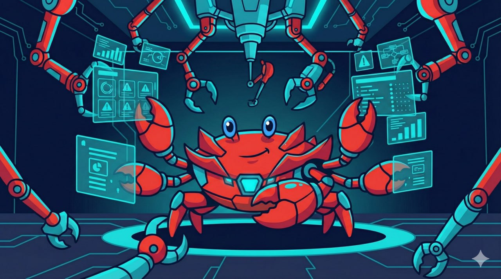

# 🦞 ClawTrol



**Open source mission control for your AI agents.**


Current release: **v2026.3.1**

ClawTrol is a kanban-style dashboard for managing AI coding agents. Track tasks, assign work to agents, monitor their activity in real-time, and collaborate asynchronously. Forked from [ClawDeck](https://github.com/clawdeckio/clawdeck) with extended agent integration features.

> 🚧 **Early Development** — ClawTrol is under active development. Expect breaking changes.

## Quick Get Started

- Self-host (recommended): clone this repo and run your own instance. See [Self-Hosting](#self-hosting).
- Contribute: PRs welcome. See [CONTRIBUTING.md](CONTRIBUTING.md).

## Features

### 🤖 ZeroBitch Fleet
Spin up and manage a Docker-based fleet of AI agents. Each agent has its own name, emoji, model, role, and mode. The auto-scaler provisions new workers on demand; the registry tracks who's alive, idle, or busy. This is the layer that turns ClawTrol from a task board into a multi-agent factory floor.

### 🏭 Factory Loops
Autonomous coding loops that run without human intervention. An agent cycles through: find → improve → test → commit → repeat. Configurable finding patterns, connected agents per loop, and cycle logs that show what each pass accomplished. Hit play and let it run overnight.

### 🌙 Nightshift
Schedule missions to run during quiet hours. Define frequency (always / weekly / one-time / auto-generated), select which tasks to launch, and ClawTrol wakes your agents at the right time. Includes a morning briefing hook so you see what ran while you slept.

### 🎭 Agent Personas
Named personas per board with their own model, emoji, and behavioral profile. Security Bot, Feature Dev, Researcher, Reviewer — each picks up tasks tagged for it and responds in character. The Persona Selector lets you switch or assign on the fly.

### 📋 Kanban Boards
Multi-board workspace with real-time WebSocket updates, drag & drop, context menus, and board tabs. Tasks move through `inbox → up_next → in_progress → in_review → done`. Each board can have its own roadmap, recurring task templates, and nightly missions.

### 🗺️ Roadmap per Board
Every board has a dedicated roadmap view. Link tasks to milestones, track progress per project, and keep long-term goals visible without mixing them into the daily queue.

### 🔁 Recurring Tasks
Define task templates that regenerate automatically. Set frequency, board, model, and description once — ClawTrol keeps the queue filled without manual work.

### 🔒 Dependency Blocking
Tasks can declare dependencies on other tasks. A 🔒 badge appears on blocked cards. The auto-runner skips blocked tasks until their dependencies are resolved.

### 💡 Swarm Ideas
A scratchpad for batch work. Drop ideas with a category and preferred model, then launch them as real tasks with one click. Good for capturing work during a planning session and executing later.

### 🔗 Saved Links
Research pipeline. Save links from anywhere, mark them as pending, and process them in batch. Agents can pull from the saved links queue for summarization or analysis tasks.

### 🖥️ Terminal — Live Agent Streaming
Tabbed terminal panel that streams agent activity via WebSocket in real time. Pin a task to keep its output visible. Full session transcript with role icons, tool calls, and file diffs. Sessions Explorer lets you inspect raw OpenClaw `.jsonl` transcripts.

### 📎 Board File Refs
Attach project files directly to boards. Agents can read them as context; humans can browse them from the task modal file viewer with syntax highlighting.

### ✅ ZeroClaw Auditor
Automated QA gate with structured checklists (coding, infra, report, research, default). Runs as a sweep job after task completion to validate agent output before human review.

### 📈 Learning Effectiveness
Tracks which agent advisories actually prevented mistakes. Scores effectiveness over time, surfaces recurring failure patterns, and graduates proven learnings into permanent agent rules.

### 🛡️ Reliability & Integration
- **OpenClaw Webhook** — instant wake on task assignment, no polling delay
- **Health gate** — checks gateway `/ready` before dispatching work
- **Delivery backoff** — retries Telegram delivery with 1s → 5s → 30s backoff
- **Delivery Target Resolver** — routes completion output back to the exact origin chat/thread
- **Security** — command injection prevention (Shellwords + allowlist), API token hashing (SHA-256), AI key encryption at rest

## How It Works

1. You create tasks and organize them on boards.
2. You move work to `up_next` and assign it to the agent queue.
3. ClawTrol auto-runner wakes runnable work with nightly gating and in-progress guardrails (base cap 4, burst cap 8 only when queue pressure is high and no recent errors/rate-limits).
4. OpenClaw is the orchestrator: it picks claimed work, routes model/persona, and executes.
5. OpenClaw must always report structured outcome via `POST /api/v1/hooks/task_outcome`.
6. OpenClaw must always persist execution output via `POST /api/v1/hooks/agent_complete` (stores in TaskRun, not description).
7. Task moves to `in_review`; follow-up is `YES/NO` plus recommendation, never silent.
8. If follow-up is needed, requeue happens only after explicit human approval, using the same card (`POST /api/v1/tasks/:id/requeue`).
9. If no follow-up is needed, task remains in `in_review` and the human decides next action.

## Tech Stack

- **Ruby** 3.3.1 / **Rails** 8.1
- **PostgreSQL** with Solid Queue, Cache, and Cable
- **Solid Queue** — Background jobs for validation, async processing, and webhook-driven workflows
- **ActionCable** — WebSocket for real-time kanban + agent activity
- **Hotwire** (Turbo + Stimulus) + **Tailwind CSS v4**
- **Propshaft** — Asset pipeline with importmap-rails
- **45+ Stimulus Controllers** — Full client-side interactivity
- **Authentication** via GitHub OAuth or email/password
- **Docker Compose** — Production-ready setup with `install.sh`

<details>
<summary>OpenClaw Onboarding and Self-Heal</summary>

- Main guide: `docs/OPENCLAW_ONBOARDING.md`
- Fast path in UI: `Settings -> Integration -> Agent Install Prompt`
- Contract summary:
  - OpenClaw executes work; ClawTrol stores state and reporting.
  - Every completed run sends both hooks: `task_outcome` then `agent_complete`.
  - Follow-up recommendation is mandatory (`needs_follow_up: true|false`).
  - Same-task follow-up is preferred to avoid kanban bloat.
  - Nightly window for Argentina: `23:00-08:00` (`America/Argentina/Buenos_Aires`, UTC-3).

</details>

## Agent Install Prompt (OpenClaw / Telegram Orchestrator)

ClawTrol works best when your orchestrator has an explicit "tooling + reporting contract" prompt so it:

- knows which endpoints exist and how to authenticate
- always reports back deterministically at the end of each run
- can requeue the same task for follow-ups (no kanban bloat)

In your running instance, open `http://<host>:<port>/settings` → `Integration` and use **Agent Install Prompt**.

If you're integrating manually:

- API endpoints live under `/api/v1/*` (Bearer token)
- Completion hooks live under `/api/v1/hooks/*` (`X-Hook-Token`)
- Follow-up is signaled via `POST /api/v1/hooks/task_outcome` with `recommended_action="requeue_same_task"`

---

## 🤖 AI-Assisted Installation & Onboarding

Have an AI assistant with shell access (OpenClaw, Claude Code, Codex)? Give it the prompt below to install ClawTrol **and** fully configure itself as your agent — API tokens, webhook hooks, heartbeat polling, and auto-runner included.

<details>
<summary>One-Prompt Install</summary>

**Copy this entire prompt to your AI assistant:**

> Install and configure ClawTrol (AI agent mission control) for me. Do ALL steps — don't stop until you've verified everything works.
>
> **Step 1 — Clone & Install**
> ```bash
> cd ~ && git clone https://github.com/wolverin0/clawtrol.git clawdeck
> cd clawdeck
> chmod +x install.sh && ./install.sh
> ```
> If Docker isn't available, fall back to manual:
> ```bash
> bundle install && bin/rails db:prepare && bin/dev
> ```
>
> **Step 2 — Wait for server**
> - Docker: port 4001
> - Manual: port 3000
> - Health check: `curl -sf http://localhost:PORT/up` (retry up to 30s)
>
> **Step 3 — Create user account**
> ```bash
> cd ~/clawdeck && bin/rails runner "
>   User.create!(
>     email: 'MY_EMAIL',
>     password: 'MY_PASSWORD',
>     name: 'MY_NAME'
>   )
>   puts '✅ User created'
> "
> ```
>
> **Step 4 — Generate API token + Hooks token**
> ```bash
> cd ~/clawdeck && bin/rails runner "
>   user = User.find_by!(email: 'MY_EMAIL')
>   api_token = user.api_tokens.create!(name: 'Agent')
>   puts 'API_TOKEN=' + api_token.token
>   puts 'HOOKS_TOKEN=' + Rails.application.config.hooks_token.to_s
> "
> ```
> Save both tokens — the API token is only shown once.
>
> **Step 5 — Create a default board**
> ```bash
> curl -s -X POST http://localhost:PORT/api/v1/boards \
>   -H "Authorization: Bearer API_TOKEN" \
>   -H "Content-Type: application/json" \
>   -d '{"name": "Main", "icon": "🚀"}' | jq .
> ```
>
> **Step 6 — Configure yourself as the ClawTrol agent**
>
> Add these to your workspace TOOLS.md (or equivalent config):
> ```
> ### ClawTrol (Task Dashboard)
> | Key | Value |
> |-----|-------|
> | URL | http://HOST:PORT |
> | API Token | API_TOKEN |
> | Hooks Token | HOOKS_TOKEN |
> | Agent Name | YOUR_AGENT_NAME |
> | Agent Emoji | YOUR_EMOJI |
> ```
>
> Add these env vars (e.g., `~/.openclaw/.env` or your agent's env):
> ```bash
> CLAWTROL_API_TOKEN=API_TOKEN
> CLAWTROL_HOOKS_TOKEN=HOOKS_TOKEN
> APP_BASE_URL=http://HOST:PORT  # Used for webhook callbacks and links
> ```
>
> **Step 7 — Set up heartbeat polling**
>
> Add to your HEARTBEAT.md (or equivalent periodic check):
> ```markdown
> ### ClawTrol Tasks
> # Health check first
> curl -sf http://HOST:PORT/up >/dev/null 2>&1 || echo "⚠️ ClawTrol DOWN"
>
> # Poll for assigned tasks
> source ~/.openclaw/.env  # or wherever your env is
> curl -s -H "Authorization: Bearer $CLAWTROL_API_TOKEN" \
>   http://HOST:PORT/api/v1/tasks?assigned=true&status=up_next
> ```
>
> **Step 7b — Origin routing (optional)**
>
> When creating tasks from a specific Telegram context, pass origin headers so output routes back correctly:
> ```bash
> curl -X POST http://HOST:PORT/api/v1/tasks \
>   -H "Authorization: Bearer API_TOKEN" \
>   -H "X-Origin-Chat-Id: YOUR_TELEGRAM_CHAT_ID" \
>   -H "X-Origin-Thread-Id: YOUR_TELEGRAM_THREAD_ID" \
>   -H "Content-Type: application/json" \
>   -d '{"task": {"name": "My task"}}'
> ```
> ClawTrol auto-detects: group chat IDs (negative) can use a default thread when none is provided; DM chat IDs (positive) use no thread.
>
> **Step 8 — Set up the completion contract**
>
> After EVERY task you complete, fire these two hooks IN ORDER:
>
> Hook 1 — `task_outcome` (structured result):
> ```bash
> curl -s -X POST http://HOST:PORT/api/v1/hooks/task_outcome \
>   -H "X-Hook-Token: $CLAWTROL_HOOKS_TOKEN" \
>   -H "Content-Type: application/json" \
>   -d '{
>     "version": "1",
>     "task_id": TASK_ID,
>     "run_id": "SESSION_UUID",
>     "ended_at": "ISO8601_TIMESTAMP",
>     "needs_follow_up": false,
>     "recommended_action": "in_review",
>     "summary": "What was accomplished",
>     "achieved": ["item 1", "item 2"],
>     "evidence": ["proof 1"],
>     "remaining": []
>   }'
> ```
>
> Hook 2 — `agent_complete` (saves output to TaskRun + transitions status):
> ```bash
> curl -s -X POST http://HOST:PORT/api/v1/hooks/agent_complete \
>   -H "X-Hook-Token: $CLAWTROL_HOOKS_TOKEN" \
>   -H "Content-Type: application/json" \
>   -d '{
>     "task_id": TASK_ID,
>     "session_id": "SESSION_UUID",
>     "findings": "Detailed summary of work done",
>     "output_files": ["file1.rb", "file2.js"]
>   }'
> ```
>
> **Step 9 — Verify the full loop**
>
> Create a test task, execute it, fire both hooks, confirm it reaches `done` (or `in_review`):
> ```bash
> # Create
> TASK=$(curl -s -X POST http://HOST:PORT/api/v1/tasks \
>   -H "Authorization: Bearer $CLAWTROL_API_TOKEN" \
>   -H "Content-Type: application/json" \
>   -d '{"name":"Test: onboarding verification","board_id":BOARD_ID,"status":"up_next","tags":["test","quick-fix"],"assigned_to_agent":true}')
> TASK_ID=$(echo $TASK | jq -r .id)
>
> # Move to in_progress
> curl -s -X PATCH http://HOST:PORT/api/v1/tasks/$TASK_ID \
>   -H "Authorization: Bearer $CLAWTROL_API_TOKEN" \
>   -H "Content-Type: application/json" \
>   -d '{"status":"in_progress"}'
>
> # Fire hooks (use a random UUID as run_id)
> # ... (fire task_outcome + agent_complete as above)
>
> # Verify final status
> curl -s -H "Authorization: Bearer $CLAWTROL_API_TOKEN" \
>   http://HOST:PORT/api/v1/tasks/$TASK_ID | jq .status
> # Should be "done" (auto-review: quick-fix + output) or "in_review"
> ```
>
> **Step 10 — Report to me**
>
> Tell me:
> - ✅ Dashboard URL
> - ✅ Board created
> - ✅ API + Hooks tokens saved
> - ✅ Heartbeat configured
> - ✅ Completion hooks tested
> - ✅ Test task verified end-to-end

**Replace before pasting:**

| Placeholder | Description |
|-------------|-------------|
| `MY_EMAIL` | Your login email |
| `MY_PASSWORD` | Secure password (12+ chars) |
| `MY_NAME` | Display name |
| `HOST:PORT` | Your server address (e.g., `localhost:4001`) |
| `YOUR_AGENT_NAME` | What your agent calls itself |
| `YOUR_EMOJI` | Agent's signature emoji |
| `BOARD_ID` | Board ID from Step 5 (usually `1`) |

**Requirements:**
- Docker (recommended) or Ruby 3.3+ with PostgreSQL
- AI assistant with shell/exec access (OpenClaw, Claude Code, Codex CLI, etc.)
- 5 minutes

</details>

<details>
<summary>Self-Hosting</summary>

## Self-Hosting

### Prerequisites
- Ruby 3.3.1
- PostgreSQL
- Bundler

### Option A: Docker Compose (recommended)
```bash
git clone https://github.com/wolverin0/clawtrol.git
cd clawtrol
chmod +x install.sh
./install.sh
```

> `install.sh` is safe to re-run and appends `SECRET_KEY_BASE` to `.env.production` only when missing.

Visit `http://localhost:4001`

### Option B: Manual Setup
```bash
git clone https://github.com/wolverin0/clawtrol.git
cd clawtrol
bundle install
bin/rails db:prepare
bin/dev
```

Visit `http://localhost:3000`

### Authentication Setup

ClawTrol supports two authentication methods:

1. **Email/Password** — Works out of the box
2. **GitHub OAuth** — Optional, recommended for production

#### GitHub OAuth Setup

1. Go to [GitHub Developer Settings](https://github.com/settings/developers)
2. Click **New OAuth App**
3. Fill in:
   - **Application name:** ClawTrol
   - **Homepage URL:** Your domain
   - **Authorization callback URL:** `https://yourdomain.com/auth/github/callback`
4. Add credentials to environment:

```bash
GITHUB_CLIENT_ID=your_client_id
GITHUB_CLIENT_SECRET=your_client_secret
```

### OpenClaw Integration

Configure webhook in Settings → OpenClaw Integration:
- **Gateway URL:** Your OpenClaw gateway endpoint
- **Gateway Token:** Your authentication token
- **Agent Prompt:** copy from `Settings -> Integration -> Agent Install Prompt`
- **Onboarding + self-heal:** [`docs/OPENCLAW_ONBOARDING.md`](docs/OPENCLAW_ONBOARDING.md)
- **Full integration guide:** [`docs/OPENCLAW_INTEGRATION.md`](docs/OPENCLAW_INTEGRATION.md)

#### Session ID Format

OpenClaw sends session identifiers in various formats. ClawTrol handles all of them:

| Format | Example | Handling |
|--------|---------|----------|
| Plain UUID | `abc123-def-456` | Used as-is |
| Prefixed (subagent) | `agent:main:subagent:abc123-def-456` | Extracts UUID after last `:` |
| Session key | `sess_abc123` | Used as-is |

**Best practice:** Send the **plain session UUID** as `session_id`. If you send a prefixed format, ClawTrol extracts the UUID automatically via `extract_session_uuid`.

**Transcript auto-discovery:** If no `session_id` is linked, ClawTrol scans recent transcript files (`~/.openclaw/agents/main/sessions/*.jsonl`) for task references and auto-links the matching session. This handles edge cases where hooks fire without session data.

### Running Tests
```bash
bin/rails test
bin/rails test:system
bin/rubocop
```

</details>

<details>
<summary>API Reference</summary>

## API Reference

ClawTrol exposes a REST API for agent integrations. Get your API token from Settings.

### Authentication

Include your token in every request:
```
Authorization: Bearer YOUR_TOKEN
```

Include agent identity headers:
```
X-Agent-Name: YourAgent
X-Agent-Emoji: 🤖
```

---

### Boards

```bash
# List boards
GET /api/v1/boards

# Get board
GET /api/v1/boards/:id

# Create board
POST /api/v1/boards
{ "name": "My Project", "icon": "🚀" }

# Update board
PATCH /api/v1/boards/:id

# Delete board
DELETE /api/v1/boards/:id
```

---

### Tasks

#### Standard CRUD

```bash
# List tasks (with filters)
GET /api/v1/tasks
GET /api/v1/tasks?board_id=1
GET /api/v1/tasks?status=in_progress
GET /api/v1/tasks?assigned=true    # Your work queue

# Get task
GET /api/v1/tasks/:id

# Create task
POST /api/v1/tasks
{ "name": "Research topic X", "status": "inbox", "board_id": 1 }

# Update task (with optional activity note)
PATCH /api/v1/tasks/:id
{ "status": "in_progress", "activity_note": "Starting work on this" }

# Delete task
DELETE /api/v1/tasks/:id

# Complete task
PATCH /api/v1/tasks/:id/complete

# Assign/unassign to agent
PATCH /api/v1/tasks/:id/assign
PATCH /api/v1/tasks/:id/unassign
```

#### Agent-Specific Endpoints

```bash
# Create task ready for agent (auto-routes to board based on name)
POST /api/v1/tasks/spawn_ready
{ "name": "ProjectName: Task title", "description": "...", "model": "opus" }

# Link agent session to task
POST /api/v1/tasks/:id/link_session
{ "agent_session_id": "uuid", "agent_session_key": "key" }

# Save agent output and complete (legacy/manual path)
POST /api/v1/tasks/:id/agent_complete
{ "output": "Task completed successfully", "status": "in_review" }

# Recover missing output from transcript (.jsonl)
POST /api/v1/tasks/:id/recover_output

# Get live agent activity log
GET /api/v1/tasks/:id/agent_log

# Check session health
GET /api/v1/tasks/:id/session_health
```

#### Follow-up Tasks

```bash
# Generate AI-suggested follow-up
POST /api/v1/tasks/:id/generate_followup

# Create follow-up task
POST /api/v1/tasks/:id/create_followup
{ "name": "Follow-up task name", "description": "..." }
```

---

### Webhook: Task Outcome (Structured Result)

`POST /api/v1/hooks/task_outcome`

**Call this FIRST** after every task execution. Reports structured results with follow-up recommendation.

**Authentication:** `X-Hook-Token: YOUR_HOOKS_TOKEN`

**Request Body (JSON)**

| Field | Type | Required | Description |
|-------|------|----------|-------------|
| `version` | string | ✅ | Always `"1"` |
| `task_id` | integer | ✅ | Target task ID |
| `run_id` | string | optional | Session UUID for this run |
| `ended_at` | string | optional | ISO8601 timestamp |
| `needs_follow_up` | boolean | ✅ | Whether task needs follow-up work |
| `recommended_action` | string | ✅ | `"in_review"` or `"requeue_same_task"` |
| `summary` | string | ✅ | What was accomplished |
| `achieved` | array | optional | List of completed items |
| `evidence` | array | optional | Proof of completion |
| `remaining` | array | optional | Items still pending |
| `next_prompt` | string | optional | Instructions for requeue (when `needs_follow_up: true`) |

**Example Request**

```bash
curl -s -X POST http://YOUR_HOST:4001/api/v1/hooks/task_outcome \
  -H "X-Hook-Token: YOUR_HOOKS_TOKEN" \
  -H "Content-Type: application/json" \
  -d '{
    "version": "1",
    "task_id": 302,
    "needs_follow_up": false,
    "recommended_action": "in_review",
    "summary": "Fixed authentication bug and added tests",
    "achieved": ["Added password validation", "Added unit tests"],
    "evidence": ["All tests pass"],
    "remaining": []
  }'
```

**Behavior:** Creates a TaskRun record with structured fields (`achieved`, `evidence`, `remaining`, `summary`). Must be called BEFORE `agent_complete`.

---

### Webhook: Agent Complete (Auto-Save Pipeline)

`POST /api/v1/hooks/agent_complete`

Primary endpoint for autonomous agents to self-report completion and persist output. This is the recommended integration path for production agents.

**Authentication**

Send webhook token in header:

```
X-Hook-Token: YOUR_HOOKS_TOKEN
```

**Request Body (JSON)**

| Field | Type | Required | Description |
|-------|------|----------|-------------|
| `task_id` | integer | ✅ | Target task ID to update |
| `findings` | string | ✅ | Work summary; stored in `task_runs.agent_output` (NOT in task description) |
| `session_id` | string | optional | Agent session UUID for transcript/activity linking |
| `session_key` | string | optional | Session key used by terminal/transcript viewer |
| `output_files` | array[string] | optional | Explicit output file list (merged with auto-extracted files) |

**Example Request**

```bash
curl -s -X POST http://YOUR_HOST:4001/api/v1/hooks/agent_complete \
  -H "X-Hook-Token: YOUR_HOOKS_TOKEN" \
  -H "Content-Type: application/json" \
  -d '{
    "task_id": 302,
    "findings": "Implemented feature X and updated docs.",
    "session_id": "abc-def-123-456",
    "session_key": "agent:main:subagent:abc",
    "output_files": ["README.md", "app/controllers/tasks_controller.rb"]
  }'
```

**Behavior**

- Stores output in `task_runs.agent_output` (structured TaskRun record, NOT description)
- Auto-transitions task status to `in_review`
- Links session metadata when provided (handles `agent:main:subagent:UUID` format — extracts clean UUID)
- Creates or updates TaskRun with `agent_output`, `agent_activity_md`, and `prompt_used`
- Auto-extracts output files from findings text and transcript commit data
- Merges + deduplicates discovered files and provided `output_files`

> **P0 Data Contract (Feb 2026):** Agent output is NO LONGER written to `tasks.description`.
> The description field is the human task brief only. All agent results go to `task_runs` table.
> Read output via `task.agent_output_text` (auto-falls back to description for legacy tasks).

**Success Response**

- `200 OK` with updated task payload

**Error Responses**

- `401 Unauthorized` — missing/invalid `X-Hook-Token`
- `404 Not Found` — task not found
- `422 Unprocessable Entity` — invalid payload (e.g., missing required fields)

### Models (Rate Limiting)

```bash
# Get all models status
GET /api/v1/models/status

# Get best available model
POST /api/v1/models/best
{ "preferred": "opus" }

# Record rate limit for a model
POST /api/v1/models/:name/limit
{ "duration_minutes": 60 }
```

---

### Nightshift

```bash
# List tonight's mission selections
GET /api/v1/nightshift/selections

# Update mission status (for agents reporting back)
PATCH /api/v1/nightshift/selections/:id
{ "status": "completed", "result": "All checks passed" }

# List all available missions
GET /api/v1/nightshift/tasks

# Launch selected missions
POST /api/v1/nightshift/launch
{ "task_ids": [1, 3, 5] }
```

### Saved Links

```bash
# List saved links
GET /api/v1/saved_links

# Create saved link
POST /api/v1/saved_links
{ "url": "https://github.com/example/repo", "title": "Example Repo" }

# Update saved link
PATCH /api/v1/saved_links/:id

# Get pending links
GET /api/v1/saved_links/pending
```

### Swarm Ideas

```bash
# List swarm ideas
GET /api/v1/swarm_ideas

# Create swarm idea
POST /api/v1/swarm_ideas
{ "swarm_idea": { "title": "Fix auth bugs", "description": "...", "category": "bug-fix", "suggested_model": "codex" } }

# Update swarm idea
PATCH /api/v1/swarm_ideas/:id

# Delete swarm idea
DELETE /api/v1/swarm_ideas/:id

# Launch idea as task
POST /api/v1/swarm_ideas/:id/launch
{ "board_id": 1, "model": "codex" }
```

### Pipeline

```bash
# Pipeline status overview
GET /api/v1/pipeline/status

# Enable pipeline on a board
POST /api/v1/pipeline/enable_board/:board_id

# Disable pipeline on a board
POST /api/v1/pipeline/disable_board/:board_id

# Get pipeline log for a task
GET /api/v1/pipeline/task/:id/log

# Reprocess a task through the pipeline
POST /api/v1/pipeline/reprocess/:id

# Route a specific task through pipeline
POST /api/v1/tasks/:id/route_pipeline

# Get pipeline info for a task
GET /api/v1/tasks/:id/pipeline_info
```

### Agent Personas

```bash
# List agent personas
GET /api/v1/agent_personas

# Create persona
POST /api/v1/agent_personas
{ "name": "Security Bot", "board_id": 1, "model": "codex" }

# Import personas
POST /api/v1/agent_personas/import

# Update persona
PATCH /api/v1/agent_personas/:id

# Delete persona
DELETE /api/v1/agent_personas/:id
```

### Factory Loops

```bash
# List factory loops
GET /api/v1/factory/loops

# Create factory loop
POST /api/v1/factory/loops
{ "name": "Nightly bugs", "board_id": 1 }

# Control loop
POST /api/v1/factory/loops/:id/play
POST /api/v1/factory/loops/:id/pause
POST /api/v1/factory/loops/:id/stop

# Loop metrics
GET /api/v1/factory/loops/:id/metrics

# Complete a factory cycle
POST /api/v1/factory/cycles/:id/complete
```

### Recurring Tasks

```bash
# List recurring task templates
GET /api/v1/tasks/recurring
```

---

### Task Statuses
| Status | Description |
|--------|-------------|
| `inbox` | New, not prioritized |
| `up_next` | Ready to be assigned |
| `in_progress` | Being worked on |
| `in_review` | Done, needs human review |
| `done` | Complete |

### Pipeline Stages
`unstarted`, `triaged`, `context_ready`, `routed`, `executing`, `verifying`, `completed`, `failed`

### Priorities
`none`, `low`, `medium`, `high`

### Models
`opus`, `codex`, `gemini`, `glm`, `sonnet`, `flash`

</details>

## UI Details

### Task Modal
- **Two-Column Layout** — Details left, agent activity + files right (desktop)
- **Auto-Save** — Debounced 500ms save on field changes
- **File Viewer** — Syntax highlighting + fullscreen for output files
- **Agent Activity** — Live session log with WebSocket updates
- **Priority Selector** — Visual fire icon buttons
- **Validation Output** — View command results inline
- **Context Menu** — Right-click cards to move between boards or statuses

## Commit Convention

This project uses [Conventional Commits](https://www.conventionalcommits.org/). A git hook validates your commit messages automatically.

**Format:** `<type>[optional scope]: <description>`

**Types:** `feat`, `fix`, `docs`, `chore`, `refactor`, `test`, `ci`, `style`, `perf`, `build`

**Setup the hook:**
```bash
ln -sf ../../bin/commit-msg-hook .git/hooks/commit-msg
```

**Generate changelog:**
```bash
bin/changelog
```

The changelog is also auto-generated on pushes to `main` via GitHub Actions.

## Contributing

We welcome contributions! Please see [CONTRIBUTING.md](CONTRIBUTING.md) for guidelines.

## License

MIT License — see [LICENSE](LICENSE) for details.

## Links

- 🐙 **GitHub:** [wolverin0/clawtrol](https://github.com/wolverin0/clawtrol)
- 🦞 **Upstream:** [clawdeckio/clawdeck](https://github.com/clawdeckio/clawdeck)

## Telegram Notification Routing (Strict Origin)

ClawTrol stores routing metadata on each task and always routes completion output to the task origin.

- **`origin_chat_id`** (string) — Telegram chat/group ID where the task originated
- **`origin_thread_id`** (integer) — Telegram topic/thread ID where the task originated
- **`origin_session_key`** (string, optional) — OpenClaw session for direct session-delivery

### Behavior

1. Task created from a Telegram topic → output is sent back to that same topic.
2. Task created from chat root (no topic) → output is sent to chat root.
3. No `origin_chat_id` → Telegram delivery is skipped (no fallback to default chat/topic).
4. There is no default-thread fallback in strict mode.

### Setup

1. Set `CLAWTROL_TELEGRAM_BOT_TOKEN` env var with your Telegram bot token.
2. Ensure task creation always includes `origin_chat_id` and, for forum topics, `origin_thread_id`.

```bash
curl -X POST http://localhost:4001/api/v1/tasks \
  -H "Authorization: Bearer $TOKEN" \
  -H "Content-Type: application/json" \
  -d '{"task": {"name": "Fix bug", "origin_chat_id": "-100123456789", "origin_thread_id": 42}}'
```

3. On `in_review` / `done`, completion notification is delivered to the stored origin.
4. Webhook notifications (`webhook_notification_url`) still work as a secondary mechanism.

---

Built with 🦞 by the OpenClaw community.
